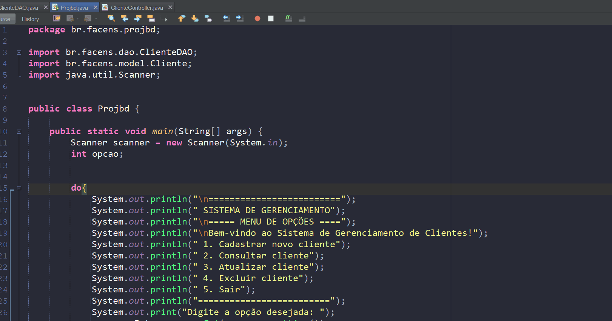
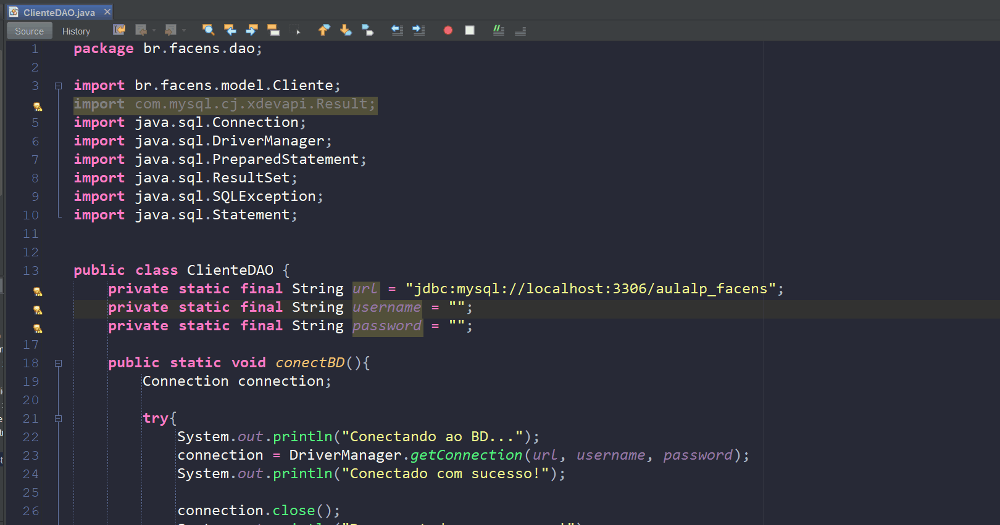

# 🛠️ Sistema de Gerenciamento de Clientes (CRUD) - Java + MySQL
Um projeto simples em Java para cadastrar, consultar, atualizar e excluir clientes em um banco de dados MySQL, via terminal.
## 📋 Funcionalidades
- **Cadastro** de cliente (id, nome, email,)
- **Consulta** de cliente (por ID)
- **Atualização** de dados
- **Exclusão** de cliente
- **Sair**
- Menu interativo no terminal
## 🚀 Tecnologias Usadas
- **Java** (JDBC para conexão com MySQL)
- **MySQL** (Banco de dados)
## 🎥 Funcionamento do Sistema
## 🖥️ ClassePrincipalMain - Interface do Sistema

**`ClassePrinciaplMain.gif`**: Demonstra o fluxo completo da interface de usuário em console, mostrando:

- Menu interativo com todas as opções de CRUD (Create, Read, Update, Delete)
- Navegação intuitiva entre as diferentes funcionalidades
- Validação básica de inputs do usuário
- Feedback visual das operações selecionadas

O GIF ilustra como a classe implementa:
✔️ Interface amigável em modo console  
✔️ Fluxo lógico de navegação entre operações  
✔️ Integração perfeita com a ClienteDAO  
✔️ Experiência de usuário clara e direta  
✔️ Tratamento básico de entradas inválidas

## 🛠️ ClasseClienteDAO - Operações com Banco de Dados

**`ClasseClienteDAO.gif`**: Demonstra o fluxo completo de interação com o banco de dados MySQL, incluindo:

- Estabelecimento da conexão JDBC com mensagens de status visíveis
- Tratamento robusto de erros (exibições claras de falhas de conexão ou queries)
- Confirmação visual de operações bem-sucedidas (INSERT, UPDATE, DELETE)
- Feedback imediato para o usuário sobre cada etapa do processo

O GIF ilustra como a classe implementa:
✔️ Conexão segura com credenciais  
✔️ Validação de operações CRUD  
✔️ Gerenciamento adequado de recursos (fechamento de conexões)  
✔️ Mensagens descritivas para diagnóstico de problemas

## 📝 Notas do Projeto

 **Contexto Acadêmico**:  
 Este é um projeto **fictício** desenvolvido para a disciplina **UPX II** da, com o objetivo de demonstrar a implementação de:  
 - Conexão JDBC com MySQL  
 - Operações CRUD em Java  
 - Boas práticas de estruturação de código 